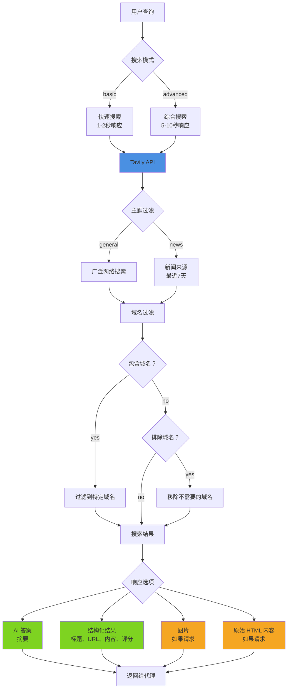

# Tavily AI 搜索

## 概述

Tavily 是一个专门为大型语言模型和 AI 应用优化的搜索引擎。与传统搜索 API 不同，Tavily 提供 AI 即用的结果，支持可选的答案生成、干净的内容提取和域名过滤功能。

**核心功能：**
- 从搜索结果中生成 AI 答案摘要
- 为 LLM 处理优化的干净、结构化结果
- 快速（`basic`）和综合（`advanced`）两种搜索模式
- 域名过滤（包含/排除特定来源）
- 针对新闻的搜索以获取当前事件
- 带相关视觉内容的图片搜索
- 用于深度分析的原始内容提取

## 架构



## 快速开始

### 基本搜索

```bash
# 简单查询，带 AI 答案
scripts/tavily_search.py "什么是量子计算？"

# 多个结果
scripts/tavily_search.py "Python 最佳实践" --max-results 10
```

### 高级搜索

```bash
# 综合研究模式
scripts/tavily_search.py "气候变化的解决方案" --depth advanced

# 新闻焦点搜索
scripts/tavily_search.py "2026 年 AI 发展" --topic news
```

### 域名过滤

```bash
# 仅搜索可信域名
scripts/tavily_search.py "Python 教程" \
  --include-domains python.org docs.python.org realpython.com

# 排除低质量来源
scripts/tavily_search.py "如何编程" \
  --exclude-domains w3schools.com geeksforgeeks.org
```

### 包含图片

```bash
# 包含相关图片
scripts/tavily_search.py "埃菲尔铁塔建筑" --images
```

## 搜索模式

### 基本与高级

| 模式 | 速度 | 覆盖范围 | 使用场景 |
|------|------|----------|----------|
| **basic** | 1-2秒 | 良好 | 快速事实、简单查询 |
| **advanced** | 5-10秒 | 优秀 | 研究、复杂主题、综合分析 |

**决策树：**
1. 需要快速事实或定义？→ 使用 `basic`
2. 研究复杂主题？→ 使用 `advanced`
3. 需要多种观点？→ 使用 `advanced`
4. 时间敏感的查询？→ 使用 `basic`

### 综合与新闻

| 主题 | 时间范围 | 来源 | 使用场景 |
|------|----------|------|----------|
| **general** | 所有时间 | 广泛网络 | 永恒内容、教程、文档 |
| **news** | 最近7天 | 新闻网站 | 当前事件、最近发展、突发新闻 |

**决策树：**
1. 查询包含"最新"、"最近"、"当前"、"今天"？→ 使用 `news`
2. 寻找历史或永恒内容？→ 使用 `general`
3. 需要最新信息？→ 使用 `news`

## API 密钥设置

### 选项 1：Clawdbot 配置（推荐）

添加到您的 Clawdbot 配置：

```json
{
  "skills": {
    "entries": {
      "tavily": {
        "enabled": true,
        "apiKey": "tvly-YOUR_API_KEY_HERE"
      }
    }
  }
}
```

通过 Clawdbot 的配置系统在脚本中访问。

### 选项 2：环境变量

```bash
export TAVILY_API_KEY="tvly-YOUR_API_KEY_HERE"
```

添加到 `~/.clawdbot/.env` 或您的 shell 配置文件中。

### 获取 API 密钥

1. 访问 https://tavily.com
2. 注册账户
3. 导航到您的仪表板
4. 生成 API 密钥（以 `tvly-` 开头）
5. 记下您套餐的速率限制和积分分配

## 常见使用场景

### 1. 研究与事实核查

```bash
# 带答案的综合研究
scripts/tavily_search.py "解释量子纠缠" --depth advanced

# 多个权威来源
scripts/tavily_search.py "REST API 设计的最佳实践" \
  --max-results 10 \
  --include-domains github.com microsoft.com google.com
```

### 2. 当前事件

```bash
# 最新新闻
scripts/tavily_search.py "AI 政策更新" --topic news

# 某个领域的最近发展
scripts/tavily_search.py "量子计算突破" \
  --topic news \
  --depth advanced
```

### 3. 特定领域研究

```bash
# 仅学术来源
scripts/tavily_search.py "机器学习算法" \
  --include-domains scholar.google.com arxiv.org
```